# UML class diagram (starting point)

Paste into https://mermaid.live or any Mermaid viewer to see it; redraw in draw.io for the report and keep it in step with the code.
`+` public, `-` private, `#` protected.

```mermaid
classDiagram
direction TB
class Record {
  <<abstract>>
  -String id
  +getId() String
  +describe()* String
  +toFields()* String[]
  +describeAll(Collection) String$
}
class Reportable { <<interface>> +getModuleName() String +generateReport() String }
class RemovalListener~T~ { <<interface>> +canRemove(T) +onRemoved(T) }
class HostelException
class InputHelper { <<utility>> +readInt() +readLong() +readDate() +readName() +readYesNo() }
class IdGenerator { <<utility>> +next(char) String$ +register(String)$ }
class ConsoleMenu { <<abstract>> #title()* #options()* #handle(int)* +run() }
class RecordStore~T~ { +load() List +save(Collection) boolean }
class HostelSystem { +rooms() +tenants() +rent() +maintenance() +visitors() }
class MainMenu
class GreenViewHostelApp { +main(String[])$ }

class Room { -String roomNumber -int capacity -long monthlyRent -List occupantIds +addOccupant(String) +updateDetails() }
class EnsuiteRoom
class RoomAllocation { -String roomId -String tenantId -LocalDate dateAllocated -LocalDate dateReleased }
class RoomService { -ArrayList rooms -ArrayList allocations +addRoom() +findRoom() +updateRoom() +removeRoom() +allocate() +release() }
class RoomFullException
class InvalidRoomException
class RoomMenu
class TenantLink { <<interface>> +tenantName() +assignRoom() +vacateRoom() }

class Tenant { <<abstract>> -String fullName -String phone -String affiliation -EmergencyContact contact -Room room +getType()* }
class StudentTenant
class WorkingTenant
class EmergencyContact { -String name -String relationship -String phone }
class TenantService { -ArrayList tenants +registerTenant() +findTenant() +search() +updateTenant() +removeTenant() +assignRoom() }
class InvalidTenantException
class TenantMenu

class RentPayment { -Tenant tenant -Room room -YearMonth period -long amountDue -List transactions +applyPayment() +getStatus() }
class PaymentTransaction { -long amount -LocalDate date }
class RentPaymentManager { -ArrayList payments +addPayment() +recordPayment() +updateAmountDue() +removePayment() }
class InvalidPaymentException
class RentMenu

class MaintenanceRequest { <<abstract>> -Room room -Priority priority -RepairStatus status +startRepair() +markCompleted() }
class TenantComplaint { -Tenant tenant }
class RoomMaintenanceRequest { -String requestedBy }
class MaintenanceService { -ArrayList requests +recordComplaint() +recordRoomRequest() +search() }
class InvalidMaintenanceException
class MaintenanceMenu

class Visitor { -String fullName -String phone }
class Visit { -Visitor visitor -Tenant tenant -LocalDate date -LocalTime checkIn -LocalTime checkOut +checkOutAt() }
class VisitorService { -ArrayList visitors -ArrayList visits +checkIn() +checkOut() }
class InvalidVisitorException
class VisitorLimitExceededException
class VisitorMenu

Record <|-- Room
Room <|-- EnsuiteRoom
Record <|-- RoomAllocation
Record <|-- Tenant
Tenant <|-- StudentTenant
Tenant <|-- WorkingTenant
Record <|-- RentPayment
Record <|-- MaintenanceRequest
MaintenanceRequest <|-- TenantComplaint
MaintenanceRequest <|-- RoomMaintenanceRequest
Record <|-- Visitor
Record <|-- Visit

Reportable <|.. RoomService
Reportable <|.. TenantService
Reportable <|.. RentPaymentManager
Reportable <|.. MaintenanceService
Reportable <|.. VisitorService
TenantLink <|.. TenantService

HostelException <|-- InvalidRoomException
HostelException <|-- RoomFullException
HostelException <|-- InvalidTenantException
HostelException <|-- InvalidPaymentException
HostelException <|-- InvalidMaintenanceException
HostelException <|-- InvalidVisitorException
HostelException <|-- VisitorLimitExceededException

ConsoleMenu <|-- MainMenu
ConsoleMenu <|-- RoomMenu
ConsoleMenu <|-- TenantMenu
ConsoleMenu <|-- RentMenu
ConsoleMenu <|-- MaintenanceMenu
ConsoleMenu <|-- VisitorMenu

RoomService o-- Room
RoomService o-- RoomAllocation
TenantService o-- Tenant
TenantService --> RoomService
Tenant --> Room : lives in
Tenant *-- EmergencyContact
RentPayment --> Tenant
RentPayment --> Room
RentPayment *-- PaymentTransaction
RentPaymentManager o-- RentPayment
RentPaymentManager --> TenantService
MaintenanceRequest --> Room
TenantComplaint --> Tenant
MaintenanceService o-- MaintenanceRequest
Visit --> Visitor
Visit --> Tenant
VisitorService o-- Visitor
VisitorService o-- Visit
RoomMenu --> RoomService
RoomMenu --> TenantLink
HostelSystem --> RoomService
HostelSystem --> TenantService
HostelSystem --> RentPaymentManager
HostelSystem --> MaintenanceService
HostelSystem --> VisitorService
MainMenu --> HostelSystem
GreenViewHostelApp --> MainMenu
RoomService ..> RecordStore
```

